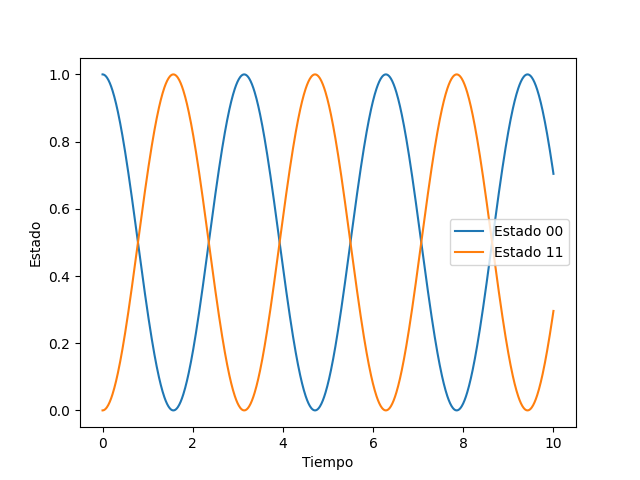

## Tutorial

A continuación, se presenta un ejemplo donde aprenderá a implementar el método RK4 para resolver un problema dinámico a través de las funciones `dyn_generator` y `rk4` documentadas en Referencias. Al final se muestra un gráfico con los resultados obetenidos.

```python
#Se importan las librerías necesarias y funciones
import numpy as np
import matplotlib as plt
from codigo.prueba import dyn_generator, rk4

#Se define el operador lineal y el estado inicial
oper = np.array([[0, 1], [1, 0]])
yInit = np.array([[1, 0], [0, 0]])

#Se define un rango para el tiempo en el cual el estado cambia, de forma que el espaciamiento temporal esté determinado por este.
tFinal = 10.0
times = np.linspace(0, tFinal, 100)
h = times[1] - times[0]

#Se definen dos listas donde se almacenará el cambio de estado del sistema.
stateQuant00 = np.zeros(times.size)
stateQuant11 = np.zeros(times.size)

#Se crea un ciclo para ir guardando el cambio en el estado debido a la función dyn_generator, el cuál es estimado por la función rk4.
for tt in range(times.size):
    stateQuant00[tt] = yInit[0, 0].real
    stateQuant11[tt] = yInit[1, 1].real
    yN = rk4(dyn_generator, oper, yInit, h)
    yInit = yN

#Se grafica finalmente los cambios en el estado en función al tiempo.
plt.plot(times, stateQuant00, label='Estado 00')
plt.plot(times, stateQuant11, label='Estado 11')
plt.xlabel('Tiempo')
plt.ylabel('Estado')
plt.legend()
plt.show()
```
La siguiente figura muestra la gráfica del Estado vs Tiempo del código:


